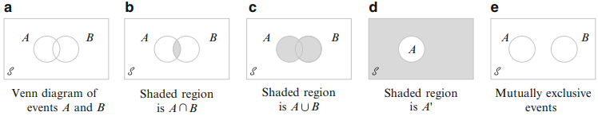
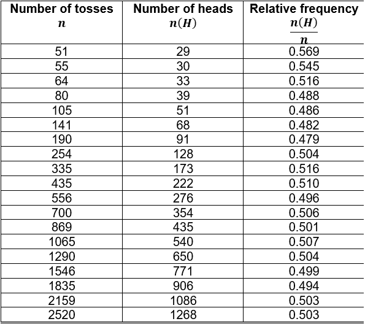
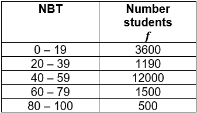
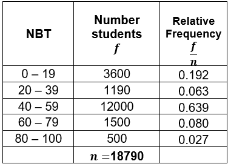
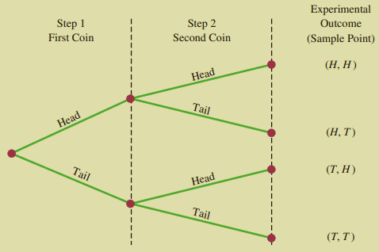
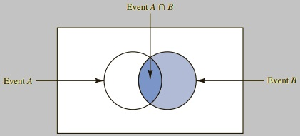
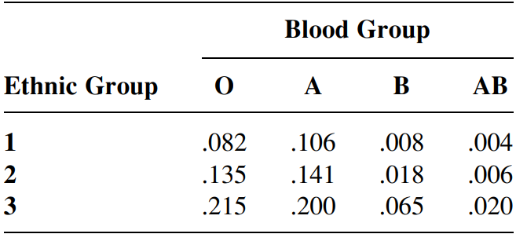

# Introduction to Probability

Now that you have learned about data, how to collect it and summarise
it, you are now ready to make use of the sample data to draw meaningful
conclusions about the sampled population. This process is referred to as
**inferential statistics** and the essential statistical tool involved
in this process is called **probability**. At its core, probability is a
measure of our **uncertainty**. Everyday we are faced with
decision-making and probability statements. Statements involving words
such as *chance*, *likelihood*, *odds*, *likely*, *expected*,
*possibility* and *probably* are all addressing the same issue:
uncertainty. Every day we say, read or hear statements such as the
following:

1.  There is a 75% *chance* of rain today.
2.  What is the *likelihood* we will a test today?
3.  I will *probably* pass this course.
4.  The *odds* are 1 in 100 million that you will be struck by
    lightning.
5.  If a single fair coin is tossed, there is a 50-50 *possibility* that
    a head will occur.

In statistics, probability allows you to evaluate the reliability of
your conclusions about the population when you have only information
from the sample data. Consider the example 5. of tossing a coin once,
the outcome will be either a head (H) or a tail (T). Suppose, as is true
in reality, that you don't know whether or not the coin is fair. You
decide to perform a simple experiment by tossing the coin $n=10$ times
and observe $10$ heads in a row. Can you conclude that the coin is fair?
Probably not, because a fair coin is *very unlikely* to yield $10$ heads
in a row. It is more likely that the coin is biased.

As with the coin-tossing example, in statistics we use probability in
two ways. When the population is known (e.g. the coin is known to be
fair), probability is used to describe the chance of observing a
particular sample outcome. When the population is unknown (e.g. it is
unknown whether or not the coin is fair) and only a sample from the
population is available, probability is used to make statements about
the population. The latter case is more likely in practice. This is the
inferential statistics we referred to above.

You know have an intuitive feeling for probability. In this chapter, we
build on this intuition by presenting the basic mathematical concepts of
probability along with some real-world examples.

## Sample space and events

### Sample space

We introduce the concept of an **experiment** as any action or process
that results in well-defined observations or outcomes. On any single
repetition or **trial** of an experiment, one and only one possible
outcome will occur. The following are examples of experiments and their
possible outcomes:

-   **Experiment**: Observing the gender of a new born baby;
    **Outcomes**: Male, Female
-   **Experiment**: Toss a coin; **Outcomes**: Head, Tail
-   **Experiment**: Selecting a part for inspection; **Outcomes**:
    Defective, Non-defective
-   **Experiment**: Conducting a sales call; **Outcomes**: Purchase,
    No-Purchase
-   **Experiment**: Rolling a die; **Outcomes**: 1,2,3,4,5,6
-   **Experiment**: Play a football game; **Outcomes**: Win, Lose, Tie

The outcomes of most experiments are uncertain. A set or collection of
all possible outcomes of an experiment is called a **sample space** and
it is denoted by $S$.\
The simplest experiment is one that has only two possible outcomes.
Consider the first experiment above of observing the gender of a new
born baby. The sample space for this experiment is given by $S=\{M,F\}$,
where $M$ represents male and $F$ represents female. Suppose that we
observed the births of two new born babies, then the sample space is
given by $S_1=\{MM,MF,FM,FF\}$, where, for instance, $MF$ indicates that
the first baby born was male and the second baby born was female.
Another possible sample space for this experiment might consist of the
number of possible male births, $S_2=\{0,1,2\}$. As a last example,
consider the experiment of rolling a six-sided die, here the sample
space is given by $S_1=\{1,2,3,4,5,6\}$. Another sample space for this
experiment might consist of whether the number facing up is even or odd,
$S_2=\{E,O\}$, where $E$ represents an even number and $O$ represents an
odd number.

::: {#ex1 .example}
Give the sample space for each of the following experiments.

a.  Toss a coin first followed by a six-sided die.
b.  Toss a coin until a tail occurs
c.  Toss a R2 coin, R1 coin and R5 coin in that order
d.  A piece of metal is measured to determine what fraction of it is
    gold.

**Solutions**

a.  $S=\{H1,H2,H3,H4,H5,H6,T1,T2,T3,T4,T5,T6\}$
b.  $S=\{H,TH,TTH,TTTH,TTTTH,\dots\}$
c.  $S=\{HHH,HTT,HHT,HTH,THT,TTH,THH,TTT\}$
d.  $S=\{p|0<p<1\}$, where $p=$ the proportion of the piece of metal
    that is gold
:::

### Events

In the study of probability, we are often interested in determining the
likelihood of the occurrence of a collection of outcomes instead of the
likelihood of the occurrence of a single outcome. For instance, in an
experiment where three coins are tossed once, we might be interested in
the outcomes which indicate that at least two heads are observed. This
collection of outcomes denoted by $A$, $A={HHT,HTH,THH,HHH}$, is called
an **event**. An **event** is any collection or subset of the sample
space. An event is said to be **simple** if it consists of exactly one
outcome and **compound** if it consists of more than one outcome. When
an experiment is performed, a particular event, say $A$, is said to
occur if the resulting outcome is contained in $A$.

Consider the experiment of tossing a R5 coin followed by a R1 coin. A
sample space for this experiment could be $S=\{HH,HT,TH,HH\}$. Some
possible events are

$$
\begin{equation}
E_1=\{HH\}\hspace{1cm}E_4=\{HH,TT\}\\
E_2=\{HT\}\hspace{1cm}E_5=\{HT,TH\}\\
E_3=\{TH\}\hspace{1cm}E_6=\{TT\}
\end{equation}
$$ Events $E_1$, $E_2$, $E_3$ and $E_6$ are simple events and events
$E_4$ and $E_5$ are compound events. There are actually a total of 16
possible events for the above experiment. As an exercise, identify the
other events. Note that the **empty set** $\emptyset$ and the sample
space $S$ are also events. The event $\mathbf{E_1}$ can be described as
getting a tail on the R5 and a tail on the R1. The event $E_4$ can be
described as getting two heads or two tails. As an exercise, describe
the remaining events.

::: {#ex2 .example}
Suppose an experiment consists of randomly selecting the exam scripts of
three students. Each student's script can either show a pass (P) or fail
(F). The experiment has eight possible outcomes: $FPP$, $FPF$, $FFP$,
$FFF$, $PFF$, $PFP$, $PPF$ and $FFF$. List the outcomes that correspond
to each of the following events:

a.  The first student failed
b.  The first and last student failed
c.  All the students passed
d.  At least one student failed
e.  At most one student failed

**Solutions**

a.  $E_1= \{FPP, FPF, FFP, FFF\}$
b.  $E_2= \{FFF, FPF\}$
c.  $E_3 = \{PPP\}$
d.  Note that at least one means one or more:

$$E_4=\{PFF, PFP, PPF, FPP, FPF, FFP, FFF\}$$

e.  Note that at most one means one or less:

$$E_5 =\{PFP, PPF, PPP, FPP\}$$
:::

::: {#ex3 .example}
Consider the experiment of tossing a red six-sided die and a black
six-sided die. This experiment consists of 36 possible outcomes. The
sample space is given below:

$$\begin{matrix}
(1,1)&(1,2)&(1,3)&(1,4)&(1,5)&(1,6)\\
(2,1)&(2,2)&(2,3)&(2,4)&(2,5)&(2,6)\\
(3,1)&(3,2)&(3,3)&(3,4)&(3,5)&(3,6)\\
(4,1)&(4,2)&(4,3)&(4,4)&(4,5)&(4,6)\\
(5,1)&(5,2)&(5,3)&(5,4)&(5,5)&(5,6)\\
(6,1)&(6,2)&(6,3)&(6,4)&(6,5)&(6,6)
\end{matrix}$$

The first entry gives the outcome of the red die and the second entry
gives the outcome of the black die. Thus, the outcome $(2,4)$, for
instance, shows that the red die came up $2$ and the black die came up
$4$.\
Give the description of the following events:

a.  $\{(1,1),(2,1),(3,1),(4,1),(5,1),(6,1)\}$
b.  $\{(1,1),(2,2),(3,3),(4,4),(5,5),(6,6)\}$
c.  $\{(3,4),(4,3),(5,2),(2,5),(6,1),(1,6)\}$
d.  $\{(5,6),(6,5)\}$
e.  $\{(1,1)\}$

**Solutions**

a.  The black die shows 1
b.  The two die match
c.  The sum of the dice equals 7
d.  The sum of the dice equals 11
e.  Both dice show a 1
:::

::: {#ex4 .example}
For the dice-tossing experiment in Example \@ref(ex:ex3) list the
outcomes for the following events:

a.  The sum is even.
b.  The sum is divisible by 5.
c.  The sum is a prime number. (A prime number is a number greater than
    1 which is divisible only by 1 and itself.)
d.  The number on the black die is 2 greater than the number on the red
    die.
e.  The sum is not even.
f.  The sum is not exactly divisible by 5

**Solutions**

a.  The following pairs have a sum that is even:

$$\begin{matrix}
(1, 1)&(1, 3)&(1,5)&(2, 2)&(2, 4)&(2, 6)\\
(3, 1)&(3, 3)&(3, 5)&(4, 2)&(4,4)&(4, 6)\\
(5, 1)&(5, 3)&(5, 5)&(6, 2)&(6,4)&(6, 6)
\end{matrix}$$

b.  The following pairs have a sum that is divisible by 5:

    $$\{(1,4),(4, 1),(3,2),(2, 3),(5, 5),(6,4),(4, 6)\}$$

c.  The following pairs have a sum that is a prime number:

$$\begin{matrix}
(1,2)&(2, 1)&(1,4)&(4, 1)&(1,6)&(6, 1)&(2, 5)\\
(5, 2)&(3,4)&(4, 3)&(5, 6)&(6, 5)&(2, 3)&(3,2)
\end{matrix}$$

d.  The following pairs have a number on the black die that is 2 greater
    than the number on the red die:

    $$\{(1,3),(2,4),(3,5),(4,6)\}$$

e.  All outcomes in $S$ that are not listed in part (a) have a sum that
    is not even.

f.  All outcomes in $S$ that are not listed in part (b) have a sum that
    is not divisible by 5.
:::

### Exercises {.unnumbered}

1.  A single die is tossed. List the simple events in the sample space
    and the list the simple events in

    a.  $A:$ Observe a number that is divisible by $3$
    b.  $B:$ Observe a number less than $5$
    c.  $C:$ Observe a number greater than $2$

2.  A sample space contains seven simple events: $E_1,E_2,\dots,E_7$.
    Use the following three events - $A=\{E_3,E_4,E_6\}$,
    $B=\{E_1,E_3,E_5,E_7\}$, and $C=\{E_2,E_4\}$ and list the simple
    events in

    a.  Both $A$ and $B$
    b.  Not $A$
    c.  $A$ or $C$ or both

3.  For each of the following experiments, define the simple events.

    a. A coin is tossed twice and the upper face (head or tail) is recorded for each toss.
    b. Three children are randomly selected and their gender is recorded


4.  Let $C$ be the event that tomorrow's weather is hot, and $D$ the
    event that it rains tomorrow. Describe (in words) the following
    compound events

    a.  $C$ or $D$
    b.  $C$ and $D$


5.  An experiment consists of asking three shoppers at random if they
    buy brand A peanut butter. Let $Y$ denote yes and $N$ denote no. Let
    $YYN$ denote the simple event that the first two polled buy brand A
    and the third does not. Further, let $E$ be the event that at least
    two people say yes and let $F$ be the event that the first person
    polled say no. List the simple events making up the following
    events:

    a.  $E$
    b.  $F$
    c.  $E$ or $F$
    d.  $E$ and $F$
    
## Some relationships between events

An event is nothing but a set. Therefore, relationships and results from
set theory can be used to study events. The following operations will be
used to construct new events from given events:

a.  The **union** of two events $A$ and $B$, denoted by $A\cup B$ and
    read "A **or** B" is the event consisting of all outcomes that are
    either in $A$ or in $B$ or in both events. This implies that the
    union includes outcomes for which both $A$ and $B$ occur as well as
    outcomes for which exactly one occurs. That is, all outcomes in at
    least one of the events.

b.  The **intersection** of two events $A$ and $B$, denoted by $A\cap B$
    and read "A **and** B" is the event consisting of all outcomes that
    are in both $A$ and $B$.

c.  The **complement** of an event $A$, denoted by $A^c$, is the set of
    all outcomes in $S$ that are not contained in $A$.

::: {#ex5 .example}
Consider the experiment of rolling a balanced six-sided die.


Let $A=\{1,3,5\}$, $B=\{2,4,6\}$ and $C=\{1,2,3\}$. Then

$A\cup B=\{1,2,3,4,5,6\}=S$, $A\cup C=\{1,2,3,5\}$, $A\cap C=\{1,3\}$
and $A^c=\{2,4,6\}$
:::

Sometimes $A$ and $B$ have no outcomes in common, so that their
intersection contains no outcomes.

d.  If events $A$ and $B$ have no outcomes in common, they are said to
    be disjoint or **mutually exclusive** events. This can be expressed
    mathematically as $A\cap B=\emptyset$, where $\emptyset$ denotes the
    event consisting of no outcomes whatsoever (the "null" or "empty"
    event).

::: {#ex6 .example name="Example 2.5 Continued"}
The events $A$ and $B$ are mutually exclusive because
$A\cap B=\emptyset$.
:::

::: {#ex7 .example}
Consider the experiment of tossing a R5 coin followed by a R1 coin. Are
the following events mutually exclusive?

a.  $A=$ two heads; $B=$ two tails
b.  $A=\{HT,TT\}$; $B=\{HT,TH\}$
c.  $A=\emptyset$; $B=\{TT\}$
d.  $A$; $A^c$

**Solutions**

a.  Yes; they have no outcomes in common
b.  No; they have the event $HT$ in common
c.  Yes; they have no outcomes in common
d.  Yes; they have no outcomes in common
:::

Sometimes it helps to use a picture called a **Venn diagram** to
describe an experiment. A Venn diagram is a graphical representation of
the sample spaces and the relationships between the events. A rectangle
commonly denotes the sample space and the events are represented by
circles drawn inside the rectangle. Figure \@ref(fig:fig2) shows
examples of Venn diagrams

```{r fig2, fig.cap="Venn diagrams",fig.align='center',echo=FALSE}

```

### Exercises {.unnumbered}

1.  Cumesh and Fani have applied for several part-time student jobs at a
    local university. Let $A$ be the event that Cumesh is hired and let
    $B$ be the event that Fani is hired. Express in terms of $A$ and $B$
    the events

<!-- -->

  a.  Cumesh is hired but not Fani
  b.  At least one of the is hired
  c.  Excactly one of them is hired

<!-- -->

2.  An academic department has just completed voting by secret ballot
    for a department head. The ballot box contains four slips with votes
    for candidate $B$. Suppose these slips are removed from the box one
    by one.

<!-- -->

  a.  List all the possible outcomes
  b.  Suppose a running tally is kept as slips are removed. For what
    outcomes does $A$ remain ahead of $B$ throughout the tally.

<!-- -->

3.  Which of the following pairs of events are mutually exclusive?

<!-- -->

  a.  $E=$ Mrs. Botha gives birth to twins. $F=$ A mother gives birth to a
    girl
  b.  $E=$ Lebogang fails the last Statistics test $F=$ Lebogang passes
    the course
  c.  $E=$ Kwanele goes to the movies $F=$ Kwanele eats pop-corn

<!-- -->

4.  A student is currently working on three assignments for three
    different subjects. Let $A_i$ denote the event that the $i^{th}$
    assignment is completed by the due date. Use the operations of
    union, intersection, and complement to describe each of the
    following events in terms of $A_1$, $A_2$, and $A_3$, draw a Venn
    diagram, and shade the region corresponding to each one.

<!-- -->

  a.  At least one assignment is completed by the due date.
  b.  All the assignments are completed by the due date.
  c.  Only the first assignment is completed by the due date.
  d.  Exactly one assignment is completed by the due date.

## Assigning Probabilities

### What is a probability?

To every event $E$ in the sample space $S$, we assign a number $P(E)$
called the probability of $E$. The probability of an event is a number
between $0$ and $1$. It is the likelihood that the event $E$ will occur.
The closer $P(E)$ is to $1$, the more likely the event $E$ is to occur.
The closer $P(E)$ is to $0$, the more unlikely the event $E$ is to
occur. Probability satisfies the following properties:

1.  $0<P(E)<1$
2.  $P(S)=1$
3.  If $E_1,E_2,E_3,\dots$ form sequences of pairwise mutually exclusive
    events of $S$, that is $E_i\cap E_j=\emptyset$, for $i\neq j$, then
    $P(E_1\cup E_2\cup E_3\cup\dots)=\sum_{i}P(E_i)$

where $\sum_{i}P(E_i)$ is the sum of the probabilities of all the
outcomes in a sample space. Consider a compound event $A$. The
probability of $A$ is defined to be the sum of the probabilities of the
outcomes contained in $A$.

::: {#ex8 .example}
Suppose a six-sided die is tossed once and the probability of any side
landing face up is $\frac{1}{6}$. If $E$ is the event of getting an even
number and $F$ is the event of getting an odd number, find

a.  $P(E)$
b.  $P(F)$
c.  $P(E~\text{or}~F)$
d.  $P(E~\text{and}~F)$

***Solutions***

The sample space is $S=\{1,2,3,4,5\}$, the event $E$ is $\{2,4,6\}$, and
the event $F$ is $\{1,3,5\}$. We thus have:

a.  $P(E)=P(2)+P(4)+P(6)=\frac{1}6+\frac{1}{6}+\frac{1}{6}$
b.  $P(E)=P(1)+P(3)+P(5)=\frac{1}6+\frac{1}{6}+\frac{1}{6}$
c.  $P(E~or~F)=P(E\cup F)=P(S)=1$
d.  $P(E~and~F)=P(E\cap F)=0$, because $E\cap F=\emptyset$.
:::

We next turn to the main question of this section which is on how to
assign probabilities to events. There are two general methods for
assigning probabilities to events: the objective method and the
subjective method. The **objective method** involves assigning
probabilities to events based on counting or repeated experiments. On
the other hand, the objective method involves assigning probabilities to
events based on intuition or personal belief. We now discuss each method
in turn.

### Objective method

Consider an experiment that can be repeatedly performed in an identical
and independent fashion and let $A$ be an event consisting of a fixed
set of outcomes of the experiment. Simple examples of repeatable
experiments include tossing a coin and rolling a die. If the experiment
is performed $n$ times, on some of the replications the event $A$ will
occur and on some $A$ will not occur. Let $n(A)$ denote the number of
replications on which $A$ does occur. Then the ratio $n(A)/n$ is called
the **relative frequency** of occurrence of the event $A$ in the $n$
replications. The empirical evidence based on the results of many of the
sequences of repeatable experiments indicate that as $n$ becomes large,
the relative frequency stabilizes. That is, as $n$ gets large, the
relative frequency approaches a limiting value referred to as the
limiting relative frequency of the event $A$. The objective method of
assigning probability identifies this limiting relative frequency with
$P(A)$. Thus, if an experiment is repeatable, we can assign
probabilities to the outcomes in accordance with their limiting relative
frequencies. As an example, The table below contains the number of heads
obtained when a fair coin was tossed $n$ times, as well as the relative
frequency $n(H)/n$ for the number of heads obtained in each case. It is
clear from the table that the limiting value of the relative frequency
of obtaining a head when a coin is tossed $n$ times will approach $0.5$
as $n$ becomes large. Therefore, the probability of $H$, obtaining a
head, is $0.5$.

```{r, fig.width=20, echo=FALSE}

```

The only problem with this approach is that the limiting relative
frequencies of events are not always known. In order to use this method,
we need to have repetitive data available and then use it to approximate
the relative frequency limits. Probabilities obtained using this
approach are said to be **empirical**. According to the empirical
approach to probability, if $A$ is an event, $P(A)$ is approximately
equal to $f/n$, where $f$ is the number of favorable outcomes and $n$ is
the number of repetitions of the experiment. Thus, $P(A)\approx f/n$.
For example, consider again the coin-tossing experiment in Table. The
relative frequency can serve as an estimate of the probability $P(H)$.
To get a better estimate, we could consider tossing the coin $3000$ or
$5000$ times or even more.

::: {#ex9 .example}
The NBT math scores for 18790 students at a large university are given
in the following grouped frequency table:

```{r fig3, fig.cap="Tree diagram for the experiment of tossing two coins",fig.align='center',echo=FALSE}

```

If a student is selected at random, what is the probability that the
student's NBT math score

a.  exceeds 39
b.  is at most 59
c.  is between 60 - 79

**Solutions** We first calculate the relative frequencies for each class
by dividing the frequency $f$ of the class by the total number of
students $n=18790$.

```{r fig4, fig.cap="Tree diagram for the experiment of tossing two coins",fig.align='center',echo=FALSE}

```

a.  $P(NBT>39)=0.343+0.157+0.043+0.014=0.557$
b.  $P(N\leq 59)=0.103+0.340+0.343+0.157=0.943$
c.  $P(60<NBT<79)=0.043$
:::

### Classical probability

If an experiment has a finite number, $n$, of outcomes that we believe
are equally likely to occur, we can assign each outcome in the sample
space $S$ a probability value of $1/n$. This is a consequence of the
second property of a probability, which states that the sum of the
probabilities for a sample space must be $1$. Then if $E$ is an event
containing $n(E)$ outcomes, the probability of $E$ occurring is simply
$n(E)/n$. Thus, we have the following basic fact:

\*If $S$ is a sample space of **equally likely outcomes**, then
$P(E)=n(E)/n$,

where $n(E)$ is the number of outcomes in $E$ and $n$ is the number of
outcomes in $S$.

The objective method for assigning probabilities using sample spaces of
equally likely outcomes is referred to as the **classical probability
method**.

::: {#ex10 .example}
Consider the dice-tossing experiment described in Example 2.3. Find the
probability that

a.  Both dice show an even number.
b.  The dice show a sum of $7$
c.  The dice show a sum of $7$ or $11$
d.  Both dice show a prime number
e.  The dice show a sum of $13$

**Solutions**

Recall that the sample space is $$\begin{matrix}
(1,1)&(1,2)&(1,3)&(1,4)&(1,5)&(1,6)\\
(2,1)&(2,2)&(2,3)&(2,4)&(2,5)&(2,6)\\
(3,1)&(3,2)&(3,3)&(3,4)&(3,5)&(3,6)\\
(4,1)&(4,2)&(4,3)&(4,4)&(4,5)&(4,6)\\
(5,1)&(5,2)&(5,3)&(5,4)&(5,5)&(5,6)\\
(6,1)&(6,2)&(6,3)&(6,4)&(6,5)&(6,6)
\end{matrix}$$ Therefore, there are $n=36$ equally likely outcomes.

a.  Let $E_1$ be the event that both dice show an even number. There are
    $n(E_1)=9$ outcomes in which both numbers are even. Therefore,
    $P(E_1)=n(E_1)/n=9/36=1/12$.
b.  Let $E_2$ be the event that the dice show a sum of $7$.
    $E_2=\{(3,4);(4,3);(5,2);(2,5);(6,1);(1,6)\}$. Therefore,
    $P(E_2)=n(E_2)/n=6/36=1/6$
c.  Let $E_3$ be the event that the dice show a sum of $7$ or $11$.
    $E_3=\{(3,4);(4,3);(5,2);(2,5);(6,1);(1,6);(5,6);(6,5)\}$.
    Therefore, $P(E_3)=n(E_3)/n=8/36=2/9$.
d.  Let $E_4$ be the event that both dice show a prime number. Since
    $E_4=\{(2,2);(2,3);(2,5);(3,2);(3,5);(5,2);(5,3);(5,5)\}$, we have
    $P(E_4)=n(E_4)/n=8/36=2/9$.
e.  Let $E_5$ be the event that the two dice show a sum of $13$. Since a
    sum of $13$ is impossible, $E_6=\emptyset$. Thus, $P(E_6)=0$.
:::

### Subjective method

The objective method of assigning probabilities is limited to
experimental situations that are repeatable. However, many real-world
experimental situations are unrepeatable. For instance, the chances of a
peace agreement in the Russia-Ukraine war. Thus, we have limited or no
information concerning the outcomes of an experiment. We must therefore
adopt an alternative interpretation of a probability. In such
situations, probabilities are assigned based on experience or expert
knowledge. For instance, a doctor treating a patient with a rare disease
must make a prognosis based on his experience with the patient and the
patient's overall medical record. When probabilities are assigned to
events based on intuition and personal beliefs, the assignment method is
called **subjective**. Because different people may have different prior
information and opinions concerning a given experimental situation,
probability assignment will differ from individual to individual.

### Exercises {.unnumbered}

1.  Match each of the following probabilities with one of the statements
    that follow:

$$ 0\quad 0.01\quad 0.3\quad 0.99\quad 1$$

a.  The event is very unlikely, but it will occur once in a while in a
    long sequence of trials.
b.  The event will occur more often than not.
c.  The event is certain.
d.  The event is impossible. It can never happen.

<!-- -->

2.  Which of the following numbers cannot be the probability of some
    event?

<!-- -->

a.  $0.74$
b.  $-1$
c.  $1.02$
d.  $0.67$

<!-- -->

3.  A 2024 survey showed that of the top 10 electric vehicles based on
    cost, 2 are BYDs, 2 are Toyotas, 3 are Renaults and 3 are Volvos.
    Choose one at random. What is the probability that the chosen EV is

<!-- -->

a.  Asian?
b.  European?
c.  Asian or European?

<!-- -->

4.  A bag contains three red pens, two blue pens and five black pens.
    One pen is selected at random. What is the probability that the pen
    is

<!-- -->

a.  red?
b.  blue?
c.  black?

<!-- -->

5.  Suppose that two dice are rolled one time, what is the probability
    of getting

<!-- -->

a.  a sum of 6?
b.  doubles?
c.  a sum of 7 or 11?
d.  a sum greater than 9?

<!-- -->

6.  In a study concerning the distribution of the ages of female CEOs in
    South Africa, 1 CEO was found to be aged between 21 - 30, 8 CEOs
    were between 31 - 40, 27 CEOs were between 41 - 50, 29 CEOs were
    between 51 - 60, 24 CEO were between 61 - 70 and 11 CEOs were 71
    years or older. Suppose that a CEO is selected at random , what is
    the probability that her age is

<!-- -->

a.  between 31 and 40?
b.  under 31?
c.  over 30 and under 51?
d.  under 31 or over 60?

<!-- -->

7.  Toss three coins 128 times and record the number of heads (0, 1, 2,
    or 3); then record your results with the theoretical probabilities.
    Compute the empirical probabilities of each.

## Mathematical properties of probability

We now mention some other important and useful mathematical properties
of probabilities.

### Probability of a complement

If events $A$ and $A^c$ are complementary events in the sample space
$S$, then $P(A^c)+P(A)=1$. Solving for $P(A^c)$, we obtain
$P(A^c)=1-P(A)$. As an example, suppose that the probability that Loyiso
will finish his assignment before the deadline is $\frac{3}{7}$. What is
the probability that he will not finish his assignment? Let $A$ be the
event that Loyiso will finish his assignment. Then, $A^c$ is the event
that he will not finish his assignment. Since $P(A)=\frac{3}{7}$, we
have $P(A^c)=1-P(A)=1-\frac{3}{7}$.

### Addition rule

For any events $A$ and $B$, $P(A\cup B)=P(A)+P(B)-P(A\cap B)$. This is
known as the **addition rule**. This rule is useful when we are
interested in knowing the probability that at least one of two events
occurs. That is, with events $A$ and $B$, we are interested in knowing
the probability that event $A$ or event $B$ or both will occur.

::: {#ex11 .example}
In a certain residential suburb, $60\%$ of all households get internet
service from the local cable company, $80\%$ get television service from
that company, and $50\%$ get both services from the company. If a
household is randomly selected, what is the probability that it gets at
least one of these services from the company?

**Solution:** Let $A=$ the event that a household gets internet service
from the cable company and $B=$ the event that household gets television
service from the cable company. The given information implies that
$P(A)=0.6$, $P(B)=0.8$ and $P(A\cap B)=0.5$.
$P(\text{at least one of the services from the company})=P(A)+P(B)-P(A\cap B)=0.6+0.8-0.5=0.9$.
:::

### Exercises {.unnumbered}

1.  Consider randomly selecting a student at a certain university, and
    let $A$ denote the event that the selected student uses ChatGPT and
    $B$ be the event that the student uses deepseek. Suppose that
    $P(A)=0.5$, $P(B)=0.4$ and $P(A\cap B)=0.25$.

<!-- -->

a.  Calculate the probability that the selected student uses at least
    one of the two chatbots (i.e. the probability of the event
    $P(A\cap B)$).
b.  What is the probability that the selected student uses neither of
    the two chatbots?
c.  Describe, in terms of $A$ and $B$, the event that the selected
    student uses ChatGPT but not deepseek and then calculate the
    probability of this event.

<!-- -->

2.  A particular University has elected both the president and deputy
    president of the student representative council. Let $A$ be the
    event that a randomly selected voter favors the presidential
    candidate and $B$ be the event that the voter favors the deputy
    presidential candidate. Suppose that $P(A^c)=0.44$, $P(B^c)=0.57$
    and $P(A\cup B)=0.68$.

<!-- -->

a.  What is the probability that a randomly selected voter is in favor
    of both candidates?
b.  What is the probability that a randomly selected voter is in favor
    of exactly one of these\
    candidates?
c.  What is the probability that a randomly selected voter is not in
    favor of at least one of these candidates?

<!-- -->

3.  A student has three options on what to do for leisure. Let
    $A_i=\{\text{do activity } i\}$, for $i=1,2,3$, and suppose that
    $P(A_1)=0.22$, $P(A_2)=0.25$, $P(A_3)=0.28$, $P(A_1\cap A_2)=0.11$,
    $P(A_1\cap A_3)=0.05$, $P(A_2\cap A_3)=0.07$. Express in words each
    of the following events and compute the probability of each event::

<!-- -->

a.  $A_1\cup A_2$
b.  $A_1^c\cap A_2^c$ [Hint: $(A_1\cup A_2)^c=A_1^c\cap A_2^c$]

<!-- -->

4.  Let $A$ be the event that the next customer that walks into a store
    will buy Coke and let $B$ be the event that the next customer that
    walks into a store will buy Pepsi. Suppose that $P(A)=0.3$ and
    $P(B)=0.5$.

<!-- -->

a.  Why is it not the case that $P(A)+P(B)=1$?
b.  Calculate $P(A^c)$.
c.  Calculate $P(A\cup B)$.
d.  Calculate $P(A^c\cap B^c)$. [Hint: Use the hint in the previous
    question]

## Basic counting rules

Whenever the outcomes of an experiment are equally likely (that is, the
same probability is assigned to each simple event in the sample space),
a necessary step towards assigning probabilities is being able to count.
Suppose that an experiment has $n$ possible outcomes and $n(A)$ is the
number of experimental outcomes contained in event $A$, then
$P(A)=n(A)/n$. If all the experimental outcomes are available or can be
listed, then $n(A)$ and $n$ can be obtained without the use of counting
rules. However, many experiments involve constructing lists of outcomes
in which $n$ and $n(A)$ are prohibitively large. Fortunately, for such
experiments, we can use some basic counting rules to calculate
probabilities without listing the experimental outcomes.

### The Fundamental counting rule

The first counting rule we discuss is referred to the **fundamental
counting rule** and it applies to experiments with multiple steps.
Consider an experiment in which five coins are tossed. Let the
experimental outcomes be defined in terms of the patterns of heads and
tails appearing on the upward faces of each of the five coins. What is
the total number of experimental outcomes? Let $H$ and $T$ denote a head
and a tail, respectively, $(H,H,H,H,H)$ indicates the experimental
outcome with a head on the first coin, second coin, third coin, fourth
coin and fifth coin. As can be seen, it is a cumbersome task to list all
of the experimental outcomes in the sample space $S$. To help us
calculate the total number of experimental outcomes without listing
them, the experiment of tossing the five coins can be thought of as a
five-step experiment: In the first step, the first coin is tossed; in
the second step, the second coin is tossed; in the third step, the third
coin is tossed; in the fourth step, the fourth coin is tossed and in the
fifth step, the fifth coin is tossed. We can make use of the fundamental
counting rule to determine the number of experimental outcomes.

```{theorem, label, name="Fundamental Counting Rule"}
If an experiment can be described as a sequence of $k$ steps with $n_1$ possible outcomes on the first step, $n_2$ possible outcomes on the second step, and so on, then the total number of exeprimental outcomes is given by $n_1\times n_2 \times \dots \times n_k$. 
```

Looking at the experiment of tossing five coins as a sequence of first
tossing one coin ($n_1=2$), followed by the second coin ($n_2=2$),
followed by the third coin ($n_3=2$), followed by the fourth coin
($n_4=2$) and then the last coin ($n_5=2$), we can see from the
fundamental counting rule that there are
$2\times 2\times 2\times 2\times 2=32$ experimental outcomes.

::: {#ex12 .example}
Consider the experiment of going to a store to buy a new phone. Once
there, you find you can select from 4 models each with 5 different
battery options and a choice of 15 exterior colors. How many possible
choices are there for you to make?

**Solution:** The experiment has three steps: The first step (Step 1)
involves choosing one of the $n_1=4$ models, the second step (Step 2)
involves choosing one of the $n_2=5$ battery options and the third step
(Step 3) involves choosing one of the $n_3=15$ exterior colors.
Therefore, by the fundamental counting rule, there are
$n_1\times n_2\times n_3=4\times 5\times 15=300$ possible choices.
:::

### Tree Diagrams

In many counting and probability problems, a visual representation of
all the outcomes of a multiple-step experiment can be constructed using
a *tree diagram*. Suppose that, in the above coin-tossing experiment, we
only tossed two coins. Figure \@ref(fig:fig5) displays a tree diagram
for the experiment of tossing two coins. The sequence of steps moves
from the left to right. The first step (Step 1) involves tossing the
first coin and the second step (Step 2) involves tossing the second
coin. For each step, there are two possible outcomes: head ($H$) or tail
($T$). Note that each possible outcome in the first step is associated
with two branches in the second step. The points (e.g. $(H,H)$) on the
right side of the tree corresponds to the experimental outcomes. Each
path from the leftmost node of the tree to the rightmost node of the
tree results in a single experimental outcome.

```{r fig5, fig.cap="Tree diagram for the experiment of tossing two coins",fig.align='center',echo=FALSE}

```

### Combinations

The second counting rule is useful when an experiment involves selecting
a subset of $k$ elements from a set of $n$ distinct elements. The
resulting sequence of $k$ elements is called a **combination**. The
number of combinations of size $k$ from $n$ distinct elements, denoted
by $C^n_k$, can be calculated as follows $$\begin{eqnarray}
C^n_k&=&\binom{n}k\\
&=&\frac{n!}{k!(n-k)!}
\end{eqnarray}$$ **Factorial notation**: For any positive integer $n$,
$n!$ is read "$n$ factorial" and is defined by
$n!=n\times(n-1)\times(n-2)\times\dots\times1$ and $0!=1$, by
definition. For instance, $4!=4\times3\times2\times1=24$.

::: {#ex13 .example}
Suppose you have five books but you only have space for two books on
your bookshelf. In how many ways can you **select** two books from the
five books?

**Solution:** Given that $n=5$ and $k=2$, there are
$C^5_2=\binom{5}2=10$ possible choices.
:::

### Permutations

The third counting rule is useful when an experiment involves selecting
a subset of $k$ elements from a fixed set of $n$ distinct elements in
such a way that the order of selection is important. Thus, the same $k$
elements selected in a different order are considered a different
experimental outcome. The resulting ordered sequence of $k$ elements is
called a **permutation**. The number of permutations of size $k$ from
$n$ distinct elements, denoted by $P^n_k$, can be calculated using the
fundamental counting rule. The first element can be chosen in $n$ ways,
the second in $(n-1)$ ways and the $k^{th}$ element in $(n-(r-1))$ ways.
Thus,

$P^n_k=n(n-1)(n-2)\times\dots\times(n-k+2)(n-k+1)$

Using the factorial notation,
$P^n_k=\frac{n(n-1)\times\dots\times(n-k+1)(n-k)(n-k-1)\times\dots\times(2)(1)}{(n-k)(n-k-1)\times\dots\times(2)(1)}$

which becomes, $P^n_k=\frac{n!}{(n-k)!}$

::: {#ex14 .example}
Suppose you have three books but you only have space for two books on
your bookshelf. In how many ways can you **select** and **arrange** the
two books.

**Solution:** Given that $n=5$ and $k=2$, there are
$P^5_2=\frac{5!}{(5-2)!}=20$ possible ways to select and arrange the two
books.
:::

A special case of the permutation counting rule is when $n=k$. Then,
$P^n_n=n!$ gives the number of ways to arrange a set of $n$ distinct
elements.

::: {#ex15 .example}
How many ways can $5$ books be arranged on a bookshelf?

**Solution:**

This is similar to selecting $k=5$ books from $n=5$ and then arranging
them on a bookshelf. Thus, there are $P^5_5=5!=120$ ways of arranging
the 5 books on a bookshelf.
:::

### Exercises {.unnumbered}

1.  If you are taking a true/false test with 10 questions, in how many
    different ways can you fill in your answer sheet if you are guessing
    the answer of each question?

2.  How many different houses can be built if a builder offers a choice
    of five basic plans, three roof styles and two exterior finishes?

3.  In how many ways can seven of ten monkeys be arranged in a row for a
    biology experiment?

4.  The student representative council has five candidates for president
    and two candidates for deputy president. Use a tree diagram to
    determine the number of ways the two offices can be filled.

5.  Three balls are selected from a box containing 10 balls. The order
    of selection is not important. How many simple events are in the
    sample space?

6.  The same car model can be purchased from five different dealerships.
    In how many ways can three dealerships be chosen from the five?

7.  A smartphone is composed of five critical parts that can be
    assembled in any order. A test is to be conducted to determine the
    time necessary for each order of assembly. If each order is to be
    tested once, how many tests must be conducted?

## Finding probabilities using the basic counting rules

The next examples demonstrate how to use the three basic counting rules
to solve probability problems.

::: {#ex16 .example}
Suppose that four coins are tossed, what is the probability of getting
four heads? **Solution** Let $A=$ the event that four heads are
observed.

We first determine the number of outcomes from tossing the four coins.
This is a multiple-step experiment involving four steps each having two
outcomes. Thus, there are $2\times2\times2\times2=16$ possible outcomes.
Next, only one outcome will result in four heads $(H,H,H,H)$. Putting it
all together, we have $n=16$ and $n(A)=1$, the probability of $A$ is
$P(A)=n(A)/n=1/16=0.0625$.
:::

::: {#ex17 .example}
Suppose that four coins are tossed, what is the probability that the
first two coins are heads?

**Solution:** Let $B=$ the event that the first two coins are heads

From the previous example, we know that there are 16 possible outcomes.
The event $B$ will occur if the first two coins are heads and the last
two coins can be either heads or tails. This is a multi-step experiment
involving four steps in which the first two steps have 1 outcome and the
last two steps have 2 outcomes. Thus, there are
$1\times1\times2\times2=4$ ways in which the event $B$ can occur.
Putting it all together, $n=16$ and $n(B)=4$, the probability of $B$ is
$P(B)=n(B)/n=4/16=0.25$.
:::

::: {#ex18 .example}
Five manufactures produce a certain electronic device, whose quality
varies from manufacturer to manufacturer. If you were to select three
manufacturers at random, what is the probability that the selection
would contain exactly two of the best three?

**Solution** The experiment consists of randomly selecting three
manufacturers from a group of five, three of which are designated as
"best" and two as "not best". Let $C=$ the event of selecting two of the
"best" three manufacturers

We first determine the number of ways of selecting any three of the five
manufacturers. Thus, $n=5$ and $k=3$, by the counting rule for
combinations, there are $C^5_3=\binom{5}3=10$ ways to choose three
manufactures from the five. Next, we determine the number of ways of
selecting exactly $2$ manufactures from the best $3$. Note that this
outcome involves a two step experiment. In the first step we must select
$2$ manufactures from the "best" three and in the second step we must
select $1$ manufacturer from the two "not best" manufacturers. With
$n=3$ and $k=2$, there are $C^3_2=\binom{3}2=3$ ways of performing the
first step. Lastly, with $n=2$ and $k=1$, there are $C^2_1=\binom{2}1$
ways of performing the second step. Thus, $3\times2=6$ ways of selecting
$2$ of the "best" $3$ manufacturers. Putting it all together, $n=10$ and
$n(C)=6$, the probability of $C$ is $P(C)=n(C)/n=6/10=0.6$.
:::

### Exercises {.unnumbered}

1.  The student representative council (SRC) must select two members
    from five (2 male and 3 female) candidates to be the president and
    deputy president of the SRC.

<!-- -->

a.  In how many ways can the two candidate be chosen in such a way that
    the president is always a female and the deputy president is always
    male?
b.  Suppose that all the candidates have an equal chance of being
    chosen, what is the probability that the president is female and the
    deputy president is male?

<!-- -->

2.  Four equally qualified runners, Naledi, Jacques, Kim and Yusuf, run
    a 100-meter print and the order of finish is recorded.

<!-- -->

a.  How many orders of finish are possible?
b.  What is the probability that Yusuf wins the sprint?
c.  What is the probability that Yusuf wins and Naledi places second?
d.  What is the probability that Kim finishes last?

<!-- -->

3.  A drawer contains four pairs of black socks, five pairs of green
    socks and six pairs of white socks. Suppose that three pairs of
    socks are randomly selected.

<!-- -->

a.  What is the probability that exactly two pairs of the selected pairs
    of socks are white?
b.  What is the probability that all three of the selected pairs of
    socks are of the same color?
c.  What is the probability that one pair of each color is selected?

## Conditional probabilities

Most of the time, the probability of an event is influenced by whether
or not a related event has already occurred. The probability of an event
$A$ occurring when we know that event $B$ has already occurred is called
a **conditional probability** and it is written as $P(A|B)$. We use the
notation $|$ to indicate that we are considering the probability of
event $A$ given the condition that event $B$ has occurred. Hence, the
notation $P(A|B)$ reads "the probability of $A$ given $B$". As an
illustration of the application of conditional probability, we consider
a study that was undertaken at a certain university to determine what
relationship, if any, exists between mathematics ability and interest in
mathematics. The ability and interest for $150$ students were determined
with the results summarized in the following table:

```{r, fig6, fig.cap="",echo=FALSE}

```

Let $L_1=$ the event that a student has a Low interest in mathematics
$A_1=$ the event that a student has a Average interest in mathematics
$H_1=$ the event that a student has a High interest in mathematics
$L_2=$ the event that a student has a Low ability in mathematics $A_2=$
the event that a student has a Average ability in mathematics $H_2=$ the
event that a student has a High ability in mathematics

Dividing the data values in the table by 150, we obtain
$P(L_1\cap L_2)=40/150=$, the probability that a student has a low
interest and low ability in mathematics. $P(L_1\cap A_2)=8/150=$, the
probability that a student has a low interest and average ability in
mathematics. $P(L_1\cap H_2)=12/150=$, the probability that a student
has a low interest and high ability in mathematics.
$P(A_1\cap L_2)=15/150=$, the probability that a student has an average
interest and low ability in mathematics. $P(A_1\cap A_2)=17/150=$, the
probability that a student has a average interest and average ability in
mathematics. $P(A_1\cap H_2)=18/150=$, the probability that a student
has an average interest and high ability in mathematics.
$P(H_1\cap L_2)=5/150=$, the probability that a student has a high
interest and low ability in mathematics. $P(H_1\cap A_2)=10/150=$, the
probability that a student has a high interest and average ability in
mathematics. $P(H_1\cap H_2)=25/150=$, the probability that a student
has a high interest and high ability in mathematics.

Since each of these values give the probabilities of the intersection of
two events, the probabilities are called **joint probabilities**. Table
\@ref(fig7) is referred to as the *joint probability table*. The table
gives a summary of the probability information.

```{r, fig7, fig.cap="Joint probability table for the mathematics interest and ability study",echo=FALSE}

```

The values in the margins of the joint probability table provide the
probabilities of each event separately. That is, $P(L_1)=0.4000$,
$P(A_1)=0.2333$, $P(H_1)=0.3667$, $P(L_2)=0.4000$, $P(A_2)=0.3333$ and
$P(H_2)=0.2667$. These probabilities are referred to as **marginal
probabilities** because of their location in the margins of the joint
probability table. Note that the marginal probabilities are obtained by
summing the joint probabilities in the corresponding row or column of
the joint probability table. For example, the marginal probability of
having a high ability in mathematics is
$P(H_1)=P(H_1\cap L2)+P(H_1\cap A2)+P(H_1\cap H2)=0.0333+0.0667+0.1667=0.2667$.\\
We now turn to our initial task of assessing whether or not there is a
relationship between mathematics ability and interest. We first
calculate the conditional probability that a randomly selected student
has a low ability in mathematics given that the student has a low
interest in mathematics. In mathematical notation, we want to calculate
$P(L_2|L_1)$. Note that $P(L_2|L_1)$ means that we are interested in the
probability of $L_2$ given that we only have $L_1$ (that is, the student
has a low interest in mathematics). Thus, $P(L_2|L_1)$ means that we are
only concerned with the mathematics ability of the $60$ students who
have a low interest in mathematics. Since $40$ of the $60$ students have
a low mathematics ability, $P(L_2|L_1)=40/60=2/3=0.6667$. Thus, given
that a student has a low interest in mathematics, there is a $67\%$
probability that the student has a low mathematics ability.\\ We have
shown that $P(L_2|L_1)=40/60=0.6667$. Dividing both the numerator and
denominator of this fraction by $150$, the total number of students in
the study, we get $$
\begin{aligned}
P(L_2|L_1)=\frac{40}{60}=\frac{40/150}{60/150}=\frac{0.2667}{0.4000}=0.6667
\end{aligned}
$$ We can see that $P(L_2|L_1)$ can be calculated as $0.2667/0.4000$.
Referring to the joint probability table (Table \@ref(fig4)), we can see
that $0.2667$ is the probability $P(L_1\cap L_2)$ and $0.4000$ is the
probability $P(L_1)$. Therefore, $P(L_2|L_1)$ can be expressed as a
ratio of the joint probability $P(L_1\cap L_2)$ to the marginal
probability $P(L_1)$

$$
\begin{aligned}
P(L_2|L_1)=\frac{P(L_1\cap L_2)}{P(L_1)}=\frac{0.2667}{0.4000}=0.6667
\end{aligned}
$$ This leads to the following general formula for calculating
conditional probabilities. For any two events $A$ and $B$, $$
\begin{eqnarray}
P(A|B)=\frac{P(A\cap B)}{P(B)}\\
\text{or}\\
P(B|A)=\frac{A\cap B}{P(A)}
\end{eqnarray}
$$ The Venn diagram in Figure \@\ref(fig:fig8) illustrates concept of a
conditional probability. The circle on the right shows that event $B$
has occurred; the portion of the circle that overlaps with event $A$
denotes the event $(A\cap B)$. We know that once event $B$ has occurred,
the only way that we can also observe event A is for the event
$(A\cap B)$ to occur. Thus, the ratio $P(A\cap B)/P(B)$ provides the
conditional probability that we will observe event $A$ given that event
$B$ has already occurred.

```{r, fig8, fig.cap="Motivating the definition of a conditional probability",echo=FALSE}

```

### Independent events

We now introduce the concept of **independent** events. Two events, $A$
and $B$ are said to be independent if $P(A|B)=P(A)$, otherwise, they are
said to be dependent. The idea behind the independence of events is that
the knowledge that the event $B$ has occurred will have no influence on
whether or not the event $A$ will occur. In other words, the happening
of one event ($B$) does not affect the happening of the other event
($A$), vice versa. In our example, we can see that $P(L_2)=0.4000$,
$P(L_2|L_1)=0.6667$, $P(L_2|A_1)=0.0533/0.2333=0.2285$ and
$P(L_2|H_1)=0.0800/0.3667=0.2182$. Thus, we see that the probability of
a low ability in mathematics is affected by the level of interest the
student has in mathematics. That is, $P(L_2|L_1)\neq P(L_2)$,
$P(L_2|A_1)\neq P(L_2)$ and $P(L_2|H_1)\neq P(L_2)$. Therefore, we can
say that the events $L_2$ and $L_1$ are dependent, the same applies to
events $L_2$ and $A_1$ as well as the events $L_2$ and $H_1$. Finally,
we can use these results to solve our initial task, which is to assess
the relationship, if any, between a student's interest and ability in
mathematics. Since the events, $L_2$ and $L_1$; $L_2$ and $A_1$ and
$L_2$ and $H_1$, are dependent, we can say that there is a relationship
between a student's interest in mathematics and their ultimate ability
in mathematics.

### Multiplication rule

From the definition of conditional probability, we can obtain the
following result $$
\begin{aligned}
P(A\cap B)=P(A|B)\times P(B)
\end{aligned}
$$ or $$
\begin{aligned}
P(A\cap B)=P(B|A)\times P(A)
\end{aligned}
$$ This is referred to as the **multiplication rule**. The
multiplication rule is useful for calculating the probability of the
intersection of two events. This rule is also important because often,
say $P(A)$ and $P(A|B)$, are given and we want to obtain $P(A\cap B)$.
This is demonstrated in the following example.

::: {#ex19 .example}
Consider a newspaper circulation department where it is known that
$84\%$ of the households in a particular neighborhood subscribe to the
daily edition of the paper. If we let $D$ denote the event that a
household subscribes to the daily edition, $P(D) = .84$. In addition, it
is known that the probability that a household that already holds a
daily subscription also subscribes to the Sunday edition (event $S$) is
$.75$; that is, $P(S ∣ D) = .75$. What is the probability that a
household subscribes to both the Sunday and daily editions of the
newspaper?

**Solution:** Using the multiplication rule, we compute the desired
$P(S\cap D)$ as $$
\begin{aligned}
P(S\cap D)=P(D)P(S | D)=.84(.75)=.63
\end{aligned}
$$ We now know that $63\%$ of the households subscribe to both the
Sunday and daily editions. When two events $A$ and $B$ are independent,
the multiplication rule can be written as $P(A\cap B)=P(A)P(B)$.
:::

### Exercises {.unnumbered}

1.  Consider an experiment that can result in one of five equally likely
    simple events $E_1,E_2,\dots,E_5$. Events $A$, $B$ and $C$ are
    defined as follows. Define the events

$$A=\{E_1,E_3\}, B=\{E_1,E_2,E_4,E_5\}\;\text{and}\;C=\{E_3,E_4\}$$

with probabilities $P(A)=0.4$, $P(B)=0.8$ and $P(C)=0.4$.

a.  Calculate the probabilities $P(A^c)$, $P(A\cap B)$, $P((A\cap B)^c)$
    and $P(A|B)$.
b.  Are the events $A$ and $B$ independent?
c.  Are the events $A$ and $B$ mutually exclusive?

<!-- -->

2.  Suppose that $P(A)=0.1$ and $P(B)=0.5$. Answer the following
    questions:

<!-- -->

a.  Given that $P(A|B)=0.1$, calculate $P(A\cap B)$.
b.  Given that $P(A|B)=0.1$, are $A$ and $B$ independent?
c.  Given that $P(A\cup B)=0.65$, are $A$ and $B$ mutually exclusive?

<!-- -->

3.  A group of research proposals was evaluated by a panel of experts to
    decide whether or not they were worthy of funding. When these same
    proposals were submitted to a second independent panel of experts,
    the decision to fund was reversed in 30% of the cases. If the
    probability that a proposal is judged worthy of funding is 0.2,
    calculate the probability that

<!-- -->

a.  a worthy proposal is approved by both panels.
b.  a worthy proposal is disapproved by both panels.
c.  a worthy proposal is approved by one panel.

<!-- -->

4.  A university student goes to one of two coffee shops on campus,
    choosing Cozy Coffee 30% of the time and Vida e Caffé 70% of the
    time. Regardless of where she goes, she buys a cafe mocha on 60% of
    her visits.

<!-- -->

a.  The next time she goes for into a coffee shop on campus, what is the
    probability that she goes to Vida e Caffé and orders a cafe mocha?
b.  Are the two events in part a. independent? Motivate your answer.
c.  If she goes into a coffee shop and orders a cafe mocha, what is the
    probability that she is in Cozy Coffee?

<!-- -->

5.  The population of a particular country consists of three ethnic
    groups. Each individual belongs to one of four major blood groups.

```{r, fig.cap="",fig.width=20,echo=FALSE}

```

Suppose that an individual is randomly selected from the population and
define the events $A=$ type A selected, $B=$type B selected and
$C=$ethnic group 3 selected.

a.  Calculate the probability $P(A)$.
b.  Calculate the probability $P(A|C)$
c.  If the selected individual does not have type $B$ blood, what is the
    probability that he or she is from ethnic group 1.

## Bayes' Theorem

Consider an experiment of rolling a die and define the two events:

$E=$ the event of observing an even number $E^c$ the event of observing
an odd number

Taken together, event $E$ and $E^c$ make up the sample space $S$,
consisting of all the possible number of points facing up, that is
$\{1,2,3,4,5,6\}$. Since a prime number can be either even (2) or
odd(1,3,5), the event $A$, which is that the number facing up is a prime
number consists of both those simple events in $A$ **and** $E$ and those
simple events in $B$ and $E^c$. Since these two events are mutually
exclusive, we can write the event $A$ as

$$
\begin{aligned}
B=(B\cap E)\cup(B\cap E^c)
\end{aligned}
$$ and

$P(B)=P(B\cap E)+P(B\cap E^c)=1/6+3/6=2/3=0.6667$

Suppose now that the sample space can be partitioned into $k$
sub-populations, $A_1,A_2,\dots,A_k$, that are mutually exclusive and
exhaustive. Events are said to be exhaustive if one $A_i$ must occur,
such that $A_1\cup A_2\cup\dots\cup A_k=S$. As above, the event $B$ can
be expressed as $$
\begin{aligned}
B=(B\cap A_1)\cup(B\cap A_2)\cup\dots\cup(B\cap A_k)
\end{aligned}
$$ Then,

$$
\begin{aligned}
P(B)=P(B\cap A_1)+P(B\cap A_2)+\dots+P(B\cap A_k)
\end{aligned}
$$ This is illustrated in Figure \@ref(fig:fig9).

```{r,fig9,fig.cap="Decomposition of the event $B$",echo=FALSE}
knitr::include_graphics("Figures/Total_Probability.png")
```

We can go one step further and use the multiplication rule to write
$P(B\cap A_i)=P(B|A_i)P(A_i)$, for $i=1,2,\dots,k$. The result is known
as the **law of total probability**.

::: {.definition name="Law of Total Probability"}
Let $A_1,A_2,\dots,A_k$ be mutually exclusive and exhaustive events.
Then for any event $B$, $$\begin{eqnarray}
P(B)&=&P(B\cap A_1)+P(B\cap A_2)+\dots+P(B\cap A_k)\\
&=&\sum^k_{i=1}P(B|A_i)P(A_i)
\end{eqnarray}$$
:::

::: {.example name="Oil Change"}
The members of a consulting firm rent cars from three rental agencies:

-   $60\%$ from agency 1
-   $30\%$ from agency 2
-   $10\%$ from agency 3

$9\%$ of the cars from agency 1 need an oil change, $20\%$ of the cars
from agency 2 need an oil change and $6\%$ of the cars from agency 3
need an oil change. Calculate the probability that a rental car
delivered to the firm will need an oil change.

**Solution:**

Let $B=$ the event that a rental car needs an oil change

We have the partition:

-   $A_1=$ the event that a car comes from agency 1
-   $A_2=$ the event that a car comes from agency 2
-   $A_3=$ the event that a car comes from agency 3

We have the following probabilities:

\begin{table}
\begin{tabular}{|l|l|l|l|}
\hline
\textbf{Partition}&$P(A_i)$&$P(B|A_i)$&$P(A_i\cap B)=P(B|A_i)\cdotP(A_i)$\\
\hline
$B_1$&$0.6$&$0.09$&$0.09(0.6)$=$0.054$\\
$B_2$&0.3&0.2&0.2(0.3)=0.054\\
$B_3$&0.1&0.06&0.06(0.1)=0.054
\hline
\end{tabular} 
\end{table}

By the law of total probability, the probability that a rental car
delivered to the firm will need an oil change is: $$\begin{eqnarray}
P(B)&=&P(B|A_1)P(A_1)+P(B|A_2)P(A_2)+P(B|A_3)P(A_3)\\
&=&0.09(0.6)+0.2(0.3)+0.06(0.1)\\
&=&0.12
\end{eqnarray}$$
:::

Now, suppose that we know that a car delivered to the firm needs an oil
change, what is the probability that the rental car came from Agency 2?
This probability can be obtained by the Bayes' Theorem.

::: {#Bayes .definition name="Bayes' Theorem"}
Let $A_1,A_2,\dots,A_k$ be mutually exclusive and exhaustive events with
$P(A_i)>0$, for $i=1,2,\dots,k$. Then for any event $B$, where $P(B)>0$,

$P(A_j|B)=\frac{P(A_j\cap B)}{P(B)}=\frac{P(B|A_j)P(A_j)}{\sum^k_{i=1}P(B|A_i)P(A_i)}$
for $j=1,2,\dots,k$
:::

Now, we return to the above question.

::: {.example name="Oil Change-Continued"}
Suppose that we know that a rental car delivered to the firm needs an
oil change, what is the probability that the rental car came from Agency
2?

**Solution:**

$$
\begin{eqnarray}
P(A_2|B)&=&\frac{P(B|A_2)P(A_2)}{P(B|A_1)P(A_1)+P(B|A_2)P(A_2)+P(B|A_3)P(A_3)}\\
&=&\frac{0.2(0.3)}{0.09(0.6)+0.2(0.3)+0.06(0.1)}\\
&=&\frac{0.06}{0.12}\\
&=&\frac{P(B\cap A_2)}{P(B)}\\
&=&0.50
\end{eqnarray}
$$ - Recall that $P(A_2)$, the probability that a rental car comes from
Agency 2 is $0.3$ - Given that it needs an oil change, the new
:::

### Exercises {.unnumbered}

1.  A sample is selected from one of two populations, $S_1$ and $S_2$,
    with $P(S_1)=0.7$ and $P(S_2)=0.3$. The probabilities that an event
    $A$ occurs, given $P(A|S_1)=0.2$ and $P(A|S_2)$, calculate

<!-- -->

a.  $P(A)$, using the Law of Total probability.
b.  $P(S_1|A)$ using Bayes' theorem.

<!-- -->

2.  A population can be divided into two subgroups that occur with
    probabilities $60\%$ and $40\%$, respectively. An event $A$ occurs
    $30\%$ of the time in the first subgroup and $50\%$ of the time in
    the second subgroup. What is the probability of the event $A$,
    regardless of which subgroup it comes from?

3.  Hatfield crime records show that $20\%$ of all crimes are violent
    and $80\%$ are non-violent, involving theft, forgery, and so on.
    Ninety percent of violent crimes are reported versus $70\%$ of
    non-violent crimes.

<!-- -->

a.  What is the overall reporting rate for crimes in Hatfield?
b.  If a crime in progress is reported to the police, what is the
    probability that it is violent? What is the probability that it is
    nonviolent?

<!-- -->

4.  Suppose that, in Gauteng, $45\%$ of all matric finalists go to the
    University of Pretoria, $35\%$ go to the University of Wits and
    $20\%$ go to the University of Johannesburg. The pass rates for
    weapons at the three universities are $0.9$, $0.8$ and $0.85$,
    respectively. If a student at one of the Universities passes, what
    is the probability that the student went to the University of
    Pretoria? University of Wits?
